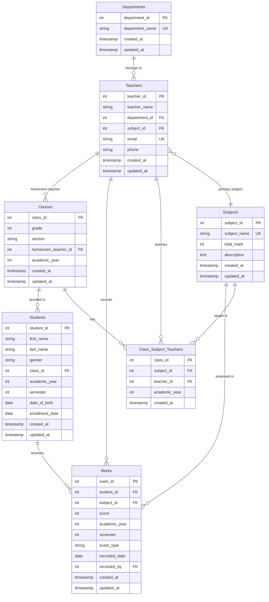
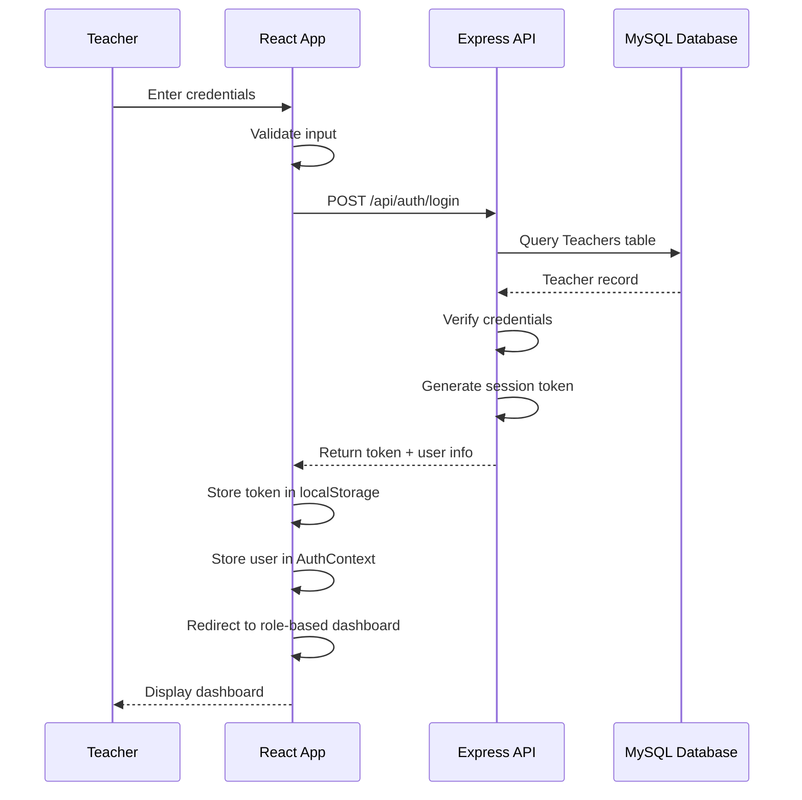
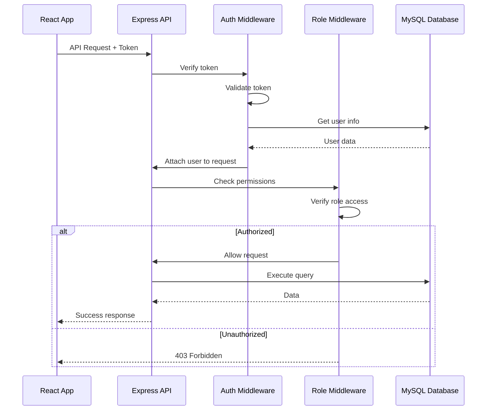

# Design Document: Student Academic Record Management System

## Overview

The Student Academic Record Management System (SRMS) is a three-tier web application that enables teachers to manage student academic records with role-based access control. The system consists of a React frontend, Node.js/Express REST API backend, and MySQL database.

### System Goals

- Provide role-based access for Subject Teachers and Homeroom Teachers
- Enable efficient mark entry and validation for academic subjects
- Automate report generation with ranking calculations
- Maintain data integrity through database constraints and validation
- Support scalable subject management without code changes

### Key Features

- User authentication with role-based routing
- Student registration and class roster management
- Subject-specific mark entry with validation (0-100 range)
- Automated report generation with ranking, totals, and pass/fail status
- Print-ready academic reports
- Class-level statistics and performance overview

## Architecture

### System Architecture

The SRMS follows a three-tier architecture pattern:

```
┌─────────────────────────────────────────────────────────────┐
│                     Presentation Layer                       │
│                    (React Frontend)                          │
│  - Role-based dashboards                                     │
│  - Form validation                                           │
│  - Report visualization                                      │
└─────────────────────┬───────────────────────────────────────┘
                      │ HTTP/REST API
                      │ (JSON)
┌─────────────────────▼───────────────────────────────────────┐
│                    Application Layer                         │
│                 (Node.js/Express API)                        │
│  - Authentication & Authorization                            │
│  - Business logic                                            │
│  - Mark validation                                           │
│  - Ranking calculation                                       │
│  - Report generation                                         │
└─────────────────────┬───────────────────────────────────────┘
                      │ SQL Queries
                      │ (mysql2)
┌─────────────────────▼───────────────────────────────────────┐
│                      Data Layer                              │
│                    (MySQL Database)                          │
│  - Relational schema                                         │
│  - Foreign key constraints                                   │
│  - Triggers & stored procedures                              │
│  - Views for common queries                                  │
└─────────────────────────────────────────────────────────────┘
```

### Technology Stack

**Frontend:**
- React 19.1.0 - UI framework
- React Router DOM 7.13.1 - Client-side routing
- Axios 1.13.6 - HTTP client
- Vite 6.3.5 - Build tool and dev server

**Backend:**
- Node.js - Runtime environment
- Express 5.2.1 - Web framework
- mysql2 3.19.1 - MySQL database driver
- CORS 2.8.6 - Cross-origin resource sharing
- dotenv 17.3.1 - Environment configuration

**Database:**
- MySQL - Relational database
- Existing schema with 8 tables, 3 views, stored procedures, and triggers

### Deployment Architecture

```
┌──────────────┐         ┌──────────────┐         ┌──────────────┐
│   Browser    │────────▶│  Vite Dev    │────────▶│   Express    │
│   Client     │  :5173  │   Server     │  :3000  │   Server     │
└──────────────┘         └──────────────┘         └──────┬───────┘
                                                          │
                                                          │ :3306
                                                   ┌──────▼───────┐
                                                   │    MySQL     │
                                                   │   Database   │
                                                   └──────────────┘
```

### Security Architecture

- Session-based authentication (to be implemented)
- Role-based access control (RBAC)
- SQL injection prevention via parameterized queries
- Input validation at both frontend and backend
- CORS configuration for API access control

## Components and Interfaces

### Frontend Component Structure

```
src/
├── components/
│   ├── Layout/
│   │   ├── Navbar.jsx              # Navigation with role-based menu
│   │   └── Sidebar.jsx             # Collapsible sidebar navigation
│   ├── Common/
│   │   ├── Button.jsx              # Reusable button component
│   │   ├── Input.jsx               # Form input with validation
│   │   ├── Select.jsx              # Dropdown select component
│   │   ├── Table.jsx               # Data table component
│   │   ├── Modal.jsx               # Modal dialog component
│   │   └── LoadingSpinner.jsx     # Loading indicator
│   ├── Auth/
│   │   └── LoginForm.jsx           # Authentication form
│   ├── Students/
│   │   ├── StudentForm.jsx         # Add/edit student form
│   │   └── StudentCard.jsx         # Student info display
│   ├── Marks/
│   │   ├── MarkEntryForm.jsx       # Mark entry with validation
│   │   └── MarkTable.jsx           # Display marks in table
│   └── Reports/
│       ├── ReportCard.jsx          # Individual student report
│       ├── ClassStatistics.jsx     # Class performance summary
│       └── PrintableReport.jsx     # Print-optimized report
├── Pages/
│   ├── Auth/
│   │   └── Login.jsx               # Login page
│   ├── Dashboard.jsx               # Role-based dashboard
│   ├── SubjectTeacher/
│   │   ├── STDashboard.jsx         # Subject teacher dashboard
│   │   ├── ClassView.jsx           # View assigned classes
│   │   └── MarkEntry.jsx           # Enter marks for subject
│   ├── HomeroomTeacher/
│   │   ├── HTDashboard.jsx         # Homeroom teacher dashboard
│   │   ├── RosterManagement.jsx   # Manage class roster
│   │   └── ReportGeneration.jsx   # Generate and print reports
│   ├── Students/
│   │   ├── StudentList.jsx         # List all students
│   │   └── StudentAdd.jsx          # Add/edit student
│   ├── Classes/
│   │   ├── ClassList.jsx           # List all classes
│   │   └── ClassAdd.jsx            # Add/edit class
│   ├── Subjects/
│   │   ├── SubjectList.jsx         # List all subjects
│   │   └── SubjectAdd.jsx          # Add/edit subject
│   └── Reports/
│       └── ReportGeneration.jsx    # Report generation interface
├── contexts/
│   └── AuthContext.jsx             # Authentication state management
├── services/
│   ├── api.js                      # Axios instance configuration
│   ├── authService.js              # Authentication API calls
│   ├── studentService.js           # Student CRUD operations
│   ├── markService.js              # Mark CRUD operations
│   ├── reportService.js            # Report generation API
│   └── classService.js             # Class management API
├── utils/
│   ├── validation.js               # Form validation helpers
│   ├── formatters.js               # Data formatting utilities
│   └── constants.js                # Application constants
├── App.jsx                         # Main application component
├── routes.jsx                      # Route definitions
└── main.jsx                        # Application entry point
```

### Backend Component Structure

```
backend/
├── config/
│   └── db.js                       # MySQL connection pool
├── middleware/
│   ├── auth.js                     # Authentication middleware
│   ├── roleCheck.js                # Role-based authorization
│   ├── validation.js               # Request validation
│   └── errorMiddleware.js          # Error handling
├── models/
│   ├── Teacher.js                  # Teacher data access
│   ├── Student.js                  # Student data access
│   ├── Class.js                    # Class data access
│   ├── Subject.js                  # Subject data access
│   ├── Mark.js                     # Mark data access
│   ├── Department.js               # Department data access
│   └── ClassSubjectTeacher.js      # Assignment data access
├── controllers/
│   ├── authController.js           # Authentication logic
│   ├── teacherController.js        # Teacher operations
│   ├── studentController.js        # Student operations
│   ├── classController.js          # Class operations
│   ├── subjectController.js        # Subject operations
│   ├── markController.js           # Mark operations
│   └── reportController.js         # Report generation
├── services/
│   ├── rankService.js              # Ranking calculation logic
│   ├── reportService.js            # Report generation logic
│   └── validationService.js        # Business validation
├── routes/
│   ├── authRoutes.js               # Authentication endpoints
│   ├── teacherRoutes.js            # Teacher endpoints
│   ├── studentRoutes.js            # Student endpoints
│   ├── classRoutes.js              # Class endpoints
│   ├── subjectRoutes.js            # Subject endpoints
│   ├── markRoutes.js               # Mark endpoints
│   └── reportRoutes.js             # Report endpoints
├── utils/
│   ├── logger.js                   # Logging utility
│   └── helpers.js                  # Helper functions
├── .env                            # Environment variables
├── server.js                       # Express server setup
└── package.json                    # Dependencies
```

### Key Component Interfaces

#### AuthContext (Frontend)

```javascript
interface AuthContextType {
  user: {
    teacher_id: number;
    teacher_name: string;
    role: 'subject_teacher' | 'homeroom_teacher';
    department_id?: number;
    class_id?: number;
  } | null;
  login: (credentials: LoginCredentials) => Promise<void>;
  logout: () => void;
  isAuthenticated: boolean;
}
```

#### Mark Entry Component Props

```javascript
interface MarkEntryFormProps {
  classId: number;
  subjectId: number;
  teacherId: number;
  academicYear: number;
  semester: 1 | 2;
  onSubmit: (marks: Mark[]) => Promise<void>;
  onCancel: () => void;
}

interface Mark {
  student_id: number;
  score: number; // 0-100
  exam_type: 'Midterm' | 'Final' | 'Quiz' | 'Assignment';
}
```

#### Report Component Props

```javascript
interface ReportCardProps {
  student: {
    student_id: number;
    full_name: string;
    class_name: string;
  };
  marks: SubjectMark[];
  total: number;
  average: number;
  rank: number;
  status: 'PASS' | 'FAIL';
  academicYear: number;
  semester: 1 | 2;
  onPrint: () => void;
}

interface SubjectMark {
  subject_name: string;
  score: number;
  recorded_by: string;
}
```

## Data Models

### Database Schema Overview

The system uses the existing MySQL database schema with 8 tables:

1. **Departments** - Subject-based organizational units
2. **Teachers** - Teacher information with department assignment
3. **Classes** - Class definitions with homeroom teacher
4. **Students** - Student enrollment information
5. **Subjects** - Academic subjects with total marks
6. **Marks** - Student scores with validation
7. **Class_Subject_Teachers** - Teaching assignments
8. **Views** - Pre-defined queries for common operations

### Entity Relationships



### Data Transfer Objects (DTOs)

#### Student Registration DTO

```javascript
{
  first_name: string,        // Required, max 50 chars
  last_name: string,         // Required, max 50 chars
  gender: 'Male' | 'Female', // Required
  class_id: number,          // Required, FK to Classes
  academic_year: number,     // Required, e.g., 2024
  semester: 1 | 2,           // Required
  date_of_birth: string      // Optional, ISO date format
}
```

#### Mark Entry DTO

```javascript
{
  student_id: number,                                    // Required
  subject_id: number,                                    // Required
  score: number,                                         // Required, 0-100
  academic_year: number,                                 // Required
  semester: 1 | 2,                                       // Required
  exam_type: 'Midterm' | 'Final' | 'Quiz' | 'Assignment', // Required
  recorded_by: number                                    // Required, teacher_id
}
```

#### Report Response DTO

```javascript
{
  student: {
    student_id: number,
    full_name: string,
    gender: string,
    class_name: string,
    academic_year: number,
    semester: number
  },
  marks: [
    {
      subject_name: string,
      score: number,
      recorded_by: string,
      recorded_date: string
    }
  ],
  total: number,           // Sum of all scores (max 500)
  average: number,         // Total / number of subjects
  rank: number,            // Position in class
  total_students: number,  // Total students in class
  status: 'PASS' | 'FAIL'  // PASS if average >= 50
}
```

### Database Views

The system leverages three existing views:

**student_details** - Combines student and class information
```sql
SELECT student_id, full_name, first_name, last_name, gender,
       academic_year, semester, date_of_birth, enrollment_date,
       grade, section, class_name, homeroom_teacher
FROM student_details;
```

**teacher_details** - Combines teacher and department information
```sql
SELECT teacher_id, teacher_name, email, phone,
       department_name, department_id
FROM teacher_details;
```

**student_performance** - Aggregates student marks with status
```sql
SELECT student_id, student_name, academic_year, semester,
       subjects_taken, average_score, total_score, status
FROM student_performance;
```

### Data Validation Rules

**Student Data:**
- first_name, last_name: Required, max 50 characters
- gender: Must be 'Male' or 'Female'
- academic_year: Required, positive integer
- semester: Must be 1 or 2
- class_id: Must reference existing class

**Mark Data:**
- score: Required, integer between 0 and 100 inclusive
- student_id: Must reference existing student
- subject_id: Must reference existing subject
- academic_year: Must match student's academic year
- semester: Must be 1 or 2
- exam_type: Must be one of: 'Midterm', 'Final', 'Quiz', 'Assignment'
- Unique constraint: One mark per student/subject/semester/exam_type

**Class Data:**
- grade: Required, positive integer (1-12)
- section: Required, max 5 characters
- academic_year: Required, positive integer
- homeroom_teacher_id: Must reference existing teacher
- Unique constraint: grade + section + academic_year

**Teacher Data:**
- teacher_name: Required, max 100 characters
- department_id: Must reference existing department
- subject_id: Required, must reference existing subject
- email: Required, unique, valid email format
- phone: Optional, max 20 characters
- Foreign key constraint: subject_id references Subjects(subject_id)


## Teacher-Subject Assignment Feature (Requirement 21)

### Overview

The Teacher-Subject Assignment feature streamlines the process of assigning teachers to classes by establishing a primary subject for each teacher at creation time. When administrators assign teachers to classes, the subject is automatically selected based on the teacher's assigned primary subject, reducing manual data entry and ensuring consistency.

### Database Schema Changes

#### Teachers Table Modification

**New Column:**
```sql
ALTER TABLE Teachers 
ADD COLUMN subject_id INT NOT NULL;
```

**Foreign Key Constraint:**
```sql
ALTER TABLE Teachers
ADD CONSTRAINT fk_teacher_subject 
FOREIGN KEY (subject_id) REFERENCES Subjects(subject_id)
ON DELETE RESTRICT
ON UPDATE CASCADE;
```

**Migration Script:**
```sql
-- Migration: Add subject_id to Teachers table
-- Date: 2024
-- Description: Add primary subject assignment for teachers

-- Step 1: Add column as nullable first (for existing data)
ALTER TABLE Teachers 
ADD COLUMN subject_id INT NULL;

-- Step 2: Update existing teachers with a default subject
-- (Administrators should manually assign correct subjects)
UPDATE Teachers t
SET t.subject_id = (
    SELECT MIN(s.subject_id) 
    FROM Subjects s
)
WHERE t.subject_id IS NULL;

-- Step 3: Make column NOT NULL
ALTER TABLE Teachers 
MODIFY COLUMN subject_id INT NOT NULL;

-- Step 4: Add foreign key constraint
ALTER TABLE Teachers
ADD CONSTRAINT fk_teacher_subject 
FOREIGN KEY (subject_id) REFERENCES Subjects(subject_id)
ON DELETE RESTRICT
ON UPDATE CASCADE;

-- Step 5: Add index for performance
CREATE INDEX idx_teacher_subject ON Teachers(subject_id);
```

### Backend Implementation

#### Teacher Model Updates

**Updated Teacher Model:**
```javascript
// models/Teacher.js
class Teacher {
  static async create(teacherData) {
    const { teacher_name, department_id, subject_id, email, phone } = teacherData;
    
    // Validate required fields
    if (!subject_id) {
      throw new Error('Primary subject is required');
    }
    
    // Verify subject exists
    const [subjects] = await db.query(
      'SELECT subject_id FROM Subjects WHERE subject_id = ?',
      [subject_id]
    );
    
    if (subjects.length === 0) {
      throw new Error('Invalid subject_id');
    }
    
    const [result] = await db.query(
      `INSERT INTO Teachers (teacher_name, department_id, subject_id, email, phone)
       VALUES (?, ?, ?, ?, ?)`,
      [teacher_name, department_id, subject_id, email, phone]
    );
    
    return this.findById(result.insertId);
  }
  
  static async findById(teacherId) {
    const [rows] = await db.query(
      `SELECT t.*, s.subject_name, d.department_name
       FROM Teachers t
       LEFT JOIN Subjects s ON t.subject_id = s.subject_id
       LEFT JOIN Departments d ON t.department_id = d.department_id
       WHERE t.teacher_id = ?`,
      [teacherId]
    );
    
    return rows[0];
  }
  
  static async findAll(filters = {}) {
    let query = `
      SELECT t.*, s.subject_name, d.department_name
      FROM Teachers t
      LEFT JOIN Subjects s ON t.subject_id = s.subject_id
      LEFT JOIN Departments d ON t.department_id = d.department_id
      WHERE 1=1
    `;
    const params = [];
    
    if (filters.department_id) {
      query += ' AND t.department_id = ?';
      params.push(filters.department_id);
    }
    
    if (filters.subject_id) {
      query += ' AND t.subject_id = ?';
      params.push(filters.subject_id);
    }
    
    query += ' ORDER BY t.teacher_name';
    
    const [rows] = await db.query(query, params);
    return rows;
  }
  
  static async update(teacherId, teacherData) {
    const { teacher_name, department_id, subject_id, email, phone } = teacherData;
    
    // Validate subject_id if provided
    if (subject_id) {
      const [subjects] = await db.query(
        'SELECT subject_id FROM Subjects WHERE subject_id = ?',
        [subject_id]
      );
      
      if (subjects.length === 0) {
        throw new Error('Invalid subject_id');
      }
    }
    
    await db.query(
      `UPDATE Teachers 
       SET teacher_name = ?, department_id = ?, subject_id = ?, email = ?, phone = ?
       WHERE teacher_id = ?`,
      [teacher_name, department_id, subject_id, email, phone, teacherId]
    );
    
    return this.findById(teacherId);
  }
}

module.exports = Teacher;
```

#### Teacher Controller Updates

**Updated Teacher Controller:**
```javascript
// controllers/teacherController.js
const Teacher = require('../models/Teacher');

exports.createTeacher = async (req, res) => {
  try {
    const { teacher_name, department_id, subject_id, email, phone } = req.body;
    
    // Validate required fields
    if (!teacher_name || !department_id || !subject_id || !email) {
      return res.status(400).json({
        success: false,
        error: 'teacher_name, department_id, subject_id, and email are required'
      });
    }
    
    const teacher = await Teacher.create({
      teacher_name,
      department_id,
      subject_id,
      email,
      phone
    });
    
    res.status(201).json({
      success: true,
      data: { teacher },
      message: 'Teacher created successfully'
    });
  } catch (error) {
    res.status(400).json({
      success: false,
      error: error.message
    });
  }
};

exports.getTeachers = async (req, res) => {
  try {
    const { department_id, subject_id } = req.query;
    
    const teachers = await Teacher.findAll({
      department_id,
      subject_id
    });
    
    res.json({
      success: true,
      data: { teachers }
    });
  } catch (error) {
    res.status(500).json({
      success: false,
      error: error.message
    });
  }
};

exports.getTeacherById = async (req, res) => {
  try {
    const { id } = req.params;
    const teacher = await Teacher.findById(id);
    
    if (!teacher) {
      return res.status(404).json({
        success: false,
        error: 'Teacher not found'
      });
    }
    
    res.json({
      success: true,
      data: { teacher }
    });
  } catch (error) {
    res.status(500).json({
      success: false,
      error: error.message
    });
  }
};

exports.updateTeacher = async (req, res) => {
  try {
    const { id } = req.params;
    const { teacher_name, department_id, subject_id, email, phone } = req.body;
    
    const teacher = await Teacher.update(id, {
      teacher_name,
      department_id,
      subject_id,
      email,
      phone
    });
    
    res.json({
      success: true,
      data: { teacher },
      message: 'Teacher updated successfully'
    });
  } catch (error) {
    res.status(400).json({
      success: false,
      error: error.message
    });
  }
};
```

#### Validation Middleware

**Teacher Validation:**
```javascript
// middleware/validation.js
exports.validateTeacherCreation = (req, res, next) => {
  const { teacher_name, department_id, subject_id, email } = req.body;
  const errors = [];
  
  if (!teacher_name || teacher_name.trim().length === 0) {
    errors.push('teacher_name is required');
  }
  
  if (!department_id || !Number.isInteger(department_id)) {
    errors.push('Valid department_id is required');
  }
  
  if (!subject_id || !Number.isInteger(subject_id)) {
    errors.push('Valid subject_id is required (primary subject assignment)');
  }
  
  if (!email || !isValidEmail(email)) {
    errors.push('Valid email is required');
  }
  
  if (errors.length > 0) {
    return res.status(400).json({
      success: false,
      errors
    });
  }
  
  next();
};

function isValidEmail(email) {
  const emailRegex = /^[^\s@]+@[^\s@]+\.[^\s@]+$/;
  return emailRegex.test(email);
}
```

### Frontend Implementation

#### ManageTeachers Component Updates

**Updated Teacher Form:**
```javascript
// pages/Admin/ManageTeachers.jsx
import { useState, useEffect } from 'react';
import { teacherService, subjectService, departmentService } from '../../services';

function ManageTeachers() {
  const [teachers, setTeachers] = useState([]);
  const [subjects, setSubjects] = useState([]);
  const [departments, setDepartments] = useState([]);
  const [formData, setFormData] = useState({
    teacher_name: '',
    department_id: '',
    subject_id: '',
    email: '',
    phone: ''
  });
  const [isEditing, setIsEditing] = useState(false);
  const [editingId, setEditingId] = useState(null);
  
  useEffect(() => {
    fetchTeachers();
    fetchSubjects();
    fetchDepartments();
  }, []);
  
  const fetchTeachers = async () => {
    const response = await teacherService.getAll();
    setTeachers(response.data.teachers);
  };
  
  const fetchSubjects = async () => {
    const response = await subjectService.getAll();
    setSubjects(response.data.subjects);
  };
  
  const fetchDepartments = async () => {
    const response = await departmentService.getAll();
    setDepartments(response.data.departments);
  };
  
  const handleSubmit = async (e) => {
    e.preventDefault();
    
    try {
      if (isEditing) {
        await teacherService.update(editingId, formData);
      } else {
        await teacherService.create(formData);
      }
      
      // Reset form
      setFormData({
        teacher_name: '',
        department_id: '',
        subject_id: '',
        email: '',
        phone: ''
      });
      setIsEditing(false);
      setEditingId(null);
      
      // Refresh list
      fetchTeachers();
    } catch (error) {
      console.error('Error saving teacher:', error);
      alert(error.message);
    }
  };
  
  const handleEdit = (teacher) => {
    setFormData({
      teacher_name: teacher.teacher_name,
      department_id: teacher.department_id,
      subject_id: teacher.subject_id,
      email: teacher.email,
      phone: teacher.phone || ''
    });
    setIsEditing(true);
    setEditingId(teacher.teacher_id);
  };
  
  return (
    <div className="manage-teachers">
      <h2>Manage Teachers</h2>
      
      <form onSubmit={handleSubmit} className="teacher-form">
        <div className="form-group">
          <label>Teacher Name *</label>
          <input
            type="text"
            value={formData.teacher_name}
            onChange={(e) => setFormData({ ...formData, teacher_name: e.target.value })}
            required
          />
        </div>
        
        <div className="form-group">
          <label>Department *</label>
          <select
            value={formData.department_id}
            onChange={(e) => setFormData({ ...formData, department_id: parseInt(e.target.value) })}
            required
          >
            <option value="">Select Department</option>
            {departments.map(dept => (
              <option key={dept.department_id} value={dept.department_id}>
                {dept.department_name}
              </option>
            ))}
          </select>
        </div>
        
        <div className="form-group">
          <label>Primary Subject *</label>
          <select
            value={formData.subject_id}
            onChange={(e) => setFormData({ ...formData, subject_id: parseInt(e.target.value) })}
            required
          >
            <option value="">Select Primary Subject</option>
            {subjects.map(subject => (
              <option key={subject.subject_id} value={subject.subject_id}>
                {subject.subject_name}
              </option>
            ))}
          </select>
          <small className="help-text">
            This subject will be automatically selected when assigning this teacher to classes
          </small>
        </div>
        
        <div className="form-group">
          <label>Email *</label>
          <input
            type="email"
            value={formData.email}
            onChange={(e) => setFormData({ ...formData, email: e.target.value })}
            required
          />
        </div>
        
        <div className="form-group">
          <label>Phone</label>
          <input
            type="tel"
            value={formData.phone}
            onChange={(e) => setFormData({ ...formData, phone: e.target.value })}
          />
        </div>
        
        <button type="submit">
          {isEditing ? 'Update Teacher' : 'Create Teacher'}
        </button>
        
        {isEditing && (
          <button type="button" onClick={() => {
            setIsEditing(false);
            setEditingId(null);
            setFormData({
              teacher_name: '',
              department_id: '',
              subject_id: '',
              email: '',
              phone: ''
            });
          }}>
            Cancel
          </button>
        )}
      </form>
      
      <div className="teachers-list">
        <h3>Teachers</h3>
        <table>
          <thead>
            <tr>
              <th>Name</th>
              <th>Department</th>
              <th>Primary Subject</th>
              <th>Email</th>
              <th>Phone</th>
              <th>Actions</th>
            </tr>
          </thead>
          <tbody>
            {teachers.map(teacher => (
              <tr key={teacher.teacher_id}>
                <td>{teacher.teacher_name}</td>
                <td>{teacher.department_name}</td>
                <td>{teacher.subject_name}</td>
                <td>{teacher.email}</td>
                <td>{teacher.phone || '-'}</td>
                <td>
                  <button onClick={() => handleEdit(teacher)}>Edit</button>
                </td>
              </tr>
            ))}
          </tbody>
        </table>
      </div>
    </div>
  );
}

export default ManageTeachers;
```

#### ManageClasses Component Updates

**Auto-fill Subject on Teacher Selection:**
```javascript
// pages/Admin/ManageClasses.jsx
function TeacherAssignmentForm({ classId, onSuccess }) {
  const [teachers, setTeachers] = useState([]);
  const [selectedTeacher, setSelectedTeacher] = useState(null);
  const [formData, setFormData] = useState({
    teacher_id: '',
    subject_id: '',
    academic_year: new Date().getFullYear()
  });
  
  useEffect(() => {
    fetchTeachers();
  }, []);
  
  const fetchTeachers = async () => {
    const response = await teacherService.getAll();
    setTeachers(response.data.teachers);
  };
  
  const handleTeacherChange = (teacherId) => {
    const teacher = teachers.find(t => t.teacher_id === parseInt(teacherId));
    
    setSelectedTeacher(teacher);
    setFormData({
      ...formData,
      teacher_id: parseInt(teacherId),
      subject_id: teacher ? teacher.subject_id : ''
    });
  };
  
  const handleSubmit = async (e) => {
    e.preventDefault();
    
    try {
      await assignmentService.create({
        class_id: classId,
        teacher_id: formData.teacher_id,
        subject_id: formData.subject_id,
        academic_year: formData.academic_year
      });
      
      onSuccess();
    } catch (error) {
      console.error('Error assigning teacher:', error);
      alert(error.message);
    }
  };
  
  return (
    <form onSubmit={handleSubmit} className="assignment-form">
      <div className="form-group">
        <label>Teacher *</label>
        <select
          value={formData.teacher_id}
          onChange={(e) => handleTeacherChange(e.target.value)}
          required
        >
          <option value="">Select Teacher</option>
          {teachers.map(teacher => (
            <option key={teacher.teacher_id} value={teacher.teacher_id}>
              {teacher.teacher_name} - {teacher.subject_name}
            </option>
          ))}
        </select>
      </div>
      
      <div className="form-group">
        <label>Subject</label>
        <input
          type="text"
          value={selectedTeacher ? selectedTeacher.subject_name : ''}
          disabled
          className="auto-filled"
        />
        <small className="help-text">
          Subject is automatically selected based on teacher's primary subject
        </small>
      </div>
      
      <div className="form-group">
        <label>Academic Year *</label>
        <input
          type="number"
          value={formData.academic_year}
          onChange={(e) => setFormData({ ...formData, academic_year: parseInt(e.target.value) })}
          required
        />
      </div>
      
      <button type="submit">Assign Teacher</button>
    </form>
  );
}
```

### Data Transfer Objects

#### Updated Teacher DTO

**Teacher Response DTO:**
```javascript
{
  teacher_id: number,
  teacher_name: string,
  department_id: number,
  department_name: string,
  subject_id: number,           // Primary subject ID
  subject_name: string,          // Primary subject name
  email: string,
  phone: string,
  created_at: string,
  updated_at: string
}
```

**Teacher Creation DTO:**
```javascript
{
  teacher_name: string,          // Required, max 100 chars
  department_id: number,         // Required, FK to Departments
  subject_id: number,            // Required, FK to Subjects (primary subject)
  email: string,                 // Required, unique, valid email
  phone: string                  // Optional, max 20 chars
}
```

### Data Flow

#### Teacher Creation Flow

```
1. Admin opens teacher creation form
   ↓
2. Form displays subject dropdown (fetched from Subjects table)
   ↓
3. Admin fills in teacher details and selects primary subject
   ↓
4. Frontend validates required fields (including subject_id)
   ↓
5. POST /api/teachers with subject_id
   ↓
6. Backend validates subject_id exists in Subjects table
   ↓
7. Backend inserts teacher with subject_id
   ↓
8. Database enforces foreign key constraint
   ↓
9. Success response includes teacher with subject_name
```

#### Teacher-Class Assignment Flow

```
1. Admin opens class assignment form
   ↓
2. Admin selects teacher from dropdown
   ↓
3. Frontend auto-fills subject field with teacher.subject_name
   ↓
4. Subject field is displayed as read-only/disabled
   ↓
5. Admin submits assignment
   ↓
6. POST /api/assignments with teacher_id and auto-selected subject_id
   ↓
7. Backend validates assignment
   ↓
8. Assignment saved with class_id, teacher_id, subject_id
```

### Validation Rules

#### Frontend Validation

- subject_id is required when creating/editing teacher
- subject_id must be a valid integer
- Subject dropdown must be populated before form submission
- Auto-selected subject in assignment form is read-only

#### Backend Validation

- subject_id is required (NOT NULL constraint)
- subject_id must reference existing subject (foreign key constraint)
- Email must be unique and valid format
- Teacher cannot be created without primary subject

#### Database Validation

- Foreign key constraint: `fk_teacher_subject`
- ON DELETE RESTRICT: Cannot delete subject if teachers are assigned to it
- ON UPDATE CASCADE: Subject ID updates propagate to Teachers table
- NOT NULL constraint on subject_id column


## API Endpoints

### Authentication Endpoints

```
POST   /api/auth/login
  Request: { email: string, password: string }
  Response: { token: string, user: TeacherInfo }
  Description: Authenticate teacher and return session token

POST   /api/auth/logout
  Request: { }
  Response: { message: string }
  Description: Invalidate current session

GET    /api/auth/me
  Request: { }
  Response: { user: TeacherInfo }
  Description: Get current authenticated user info
```

### Teacher Endpoints

```
GET    /api/teachers
  Query: ?department_id=<id>
  Response: { teachers: Teacher[] }
  Description: List all teachers with subject information, optionally filtered by department

GET    /api/teachers/:id
  Response: { teacher: Teacher }
  Description: Get teacher details by ID including primary subject name

POST   /api/teachers
  Request: { teacher_name, department_id, subject_id, email, phone }
  Response: { teacher: Teacher }
  Description: Create new teacher with required primary subject assignment
  Validation: subject_id is required and must reference existing subject

PUT    /api/teachers/:id
  Request: { teacher_name, department_id, subject_id, email, phone }
  Response: { teacher: Teacher }
  Description: Update teacher information including primary subject

DELETE /api/teachers/:id
  Response: { message: string }
  Description: Delete teacher
```

### Student Endpoints

```
GET    /api/students
  Query: ?class_id=<id>&academic_year=<year>&semester=<sem>
  Response: { students: Student[] }
  Description: List students with optional filters
  Authorization: Subject teachers see only assigned classes

GET    /api/students/:id
  Response: { student: Student }
  Description: Get student details by ID

POST   /api/students
  Request: { first_name, last_name, gender, class_id, academic_year, semester, date_of_birth }
  Response: { student: Student }
  Description: Register new student
  Authorization: Homeroom teachers only

PUT    /api/students/:id
  Request: { first_name, last_name, gender, class_id, academic_year, semester }
  Response: { student: Student }
  Description: Update student information
  Authorization: Homeroom teachers only

DELETE /api/students/:id
  Response: { message: string }
  Description: Remove student from class
  Authorization: Homeroom teachers only
```

### Class Endpoints

```
GET    /api/classes
  Query: ?academic_year=<year>
  Response: { classes: Class[] }
  Description: List all classes
  Authorization: Subject teachers see only assigned classes

GET    /api/classes/:id
  Response: { class: Class, students: Student[] }
  Description: Get class details with student roster

GET    /api/classes/:id/students
  Query: ?academic_year=<year>&semester=<sem>
  Response: { students: Student[] }
  Description: Get students in a class

POST   /api/classes
  Request: { grade, section, homeroom_teacher_id, academic_year }
  Response: { class: Class }
  Description: Create new class

PUT    /api/classes/:id
  Request: { grade, section, homeroom_teacher_id, academic_year }
  Response: { class: Class }
  Description: Update class information
```

### Subject Endpoints

```
GET    /api/subjects
  Response: { subjects: Subject[] }
  Description: List all subjects

GET    /api/subjects/:id
  Response: { subject: Subject }
  Description: Get subject details

POST   /api/subjects
  Request: { subject_name, total_mark, description }
  Response: { subject: Subject }
  Description: Add new subject

PUT    /api/subjects/:id
  Request: { subject_name, total_mark, description }
  Response: { subject: Subject }
  Description: Update subject information
```

### Mark Endpoints

```
GET    /api/marks
  Query: ?student_id=<id>&class_id=<id>&subject_id=<id>&academic_year=<year>&semester=<sem>
  Response: { marks: Mark[] }
  Description: List marks with filters
  Authorization: Teachers see only their assigned classes/subjects

GET    /api/marks/student/:student_id
  Query: ?academic_year=<year>&semester=<sem>
  Response: { marks: Mark[] }
  Description: Get all marks for a student

POST   /api/marks
  Request: { student_id, subject_id, score, academic_year, semester, exam_type }
  Response: { mark: Mark }
  Description: Record a single mark
  Authorization: Subject teachers for their subject only
  Validation: score 0-100, unique per student/subject/semester/exam_type

POST   /api/marks/batch
  Request: { marks: Mark[], class_id, subject_id, academic_year, semester }
  Response: { marks: Mark[], submitted_count: number }
  Description: Submit all marks for a class at once
  Authorization: Subject teachers for their subject only

PUT    /api/marks/:id
  Request: { score }
  Response: { mark: Mark }
  Description: Update mark before submission
  Authorization: Teacher who recorded the mark

DELETE /api/marks/:id
  Response: { message: string }
  Description: Delete mark before submission
  Authorization: Teacher who recorded the mark
```

### Report Endpoints

```
GET    /api/reports/student/:student_id
  Query: ?academic_year=<year>&semester=<sem>
  Response: { report: StudentReport }
  Description: Generate report for a single student
  Authorization: Homeroom teacher of student's class

GET    /api/reports/class/:class_id
  Query: ?academic_year=<year>&semester=<sem>
  Response: { reports: StudentReport[] }
  Description: Generate reports for all students in a class
  Authorization: Homeroom teacher of the class

GET    /api/reports/class/:class_id/statistics
  Query: ?academic_year=<year>&semester=<sem>
  Response: { statistics: ClassStatistics }
  Description: Get class-level performance statistics
  Authorization: Homeroom teacher of the class
```

### Assignment Endpoints

```
GET    /api/assignments/teacher/:teacher_id
  Query: ?academic_year=<year>
  Response: { assignments: ClassSubjectTeacher[] }
  Description: Get teaching assignments for a teacher

POST   /api/assignments
  Request: { class_id, subject_id, teacher_id, academic_year }
  Response: { assignment: ClassSubjectTeacher }
  Description: Assign teacher to teach subject to class

DELETE /api/assignments
  Request: { class_id, subject_id, academic_year }
  Response: { message: string }
  Description: Remove teaching assignment
```

### API Response Format

All API responses follow a consistent format:

**Success Response:**
```javascript
{
  success: true,
  data: { /* response data */ },
  message: "Operation successful"
}
```

**Error Response:**
```javascript
{
  success: false,
  error: {
    code: "ERROR_CODE",
    message: "Human-readable error message",
    details: { /* additional error context */ }
  }
}
```

### HTTP Status Codes

- 200 OK - Successful GET, PUT, DELETE
- 201 Created - Successful POST
- 400 Bad Request - Validation error
- 401 Unauthorized - Authentication required
- 403 Forbidden - Insufficient permissions
- 404 Not Found - Resource not found
- 409 Conflict - Duplicate entry
- 500 Internal Server Error - Server error


## Authentication and Authorization Flow

### Authentication Flow



### Authorization Flow



### Role-Based Access Control

#### Subject Teacher Permissions

**Can Access:**
- View assigned classes only
- View students in assigned classes only
- Enter marks for assigned subject only
- Edit marks before submission
- Submit marks for assigned classes

**Cannot Access:**
- Add/remove students
- View other teachers' classes
- Enter marks for other subjects
- Generate reports
- View marks after submission by other teachers

#### Homeroom Teacher Permissions

**Can Access:**
- View assigned class
- Add/remove students in assigned class
- View all marks for students in assigned class
- Generate reports for assigned class
- View class statistics
- Print reports

**Cannot Access:**
- Enter marks for subjects
- View other classes
- Modify marks entered by subject teachers
- Manage teacher assignments

### Authentication Implementation

**Session Storage:**
```javascript
// Frontend - localStorage
{
  token: "jwt_token_string",
  user: {
    teacher_id: 1,
    teacher_name: "John Doe",
    role: "subject_teacher",
    department_id: 2,
    email: "john@school.com"
  }
}
```

**Backend Middleware:**
```javascript
// auth.js middleware
async function authenticate(req, res, next) {
  const token = req.headers.authorization?.split(' ')[1];
  
  if (!token) {
    return res.status(401).json({ error: 'Authentication required' });
  }
  
  try {
    const decoded = verifyToken(token);
    const teacher = await Teacher.findById(decoded.teacher_id);
    
    if (!teacher) {
      return res.status(401).json({ error: 'Invalid token' });
    }
    
    req.user = teacher;
    next();
  } catch (error) {
    return res.status(401).json({ error: 'Invalid token' });
  }
}
```

**Role Determination:**
```javascript
// Determine role based on database relationships
function determineRole(teacher) {
  // Check if teacher is homeroom teacher
  const isHomeroomTeacher = await Class.findOne({
    homeroom_teacher_id: teacher.teacher_id
  });
  
  if (isHomeroomTeacher) {
    return {
      role: 'homeroom_teacher',
      class_id: isHomeroomTeacher.class_id
    };
  }
  
  // Otherwise, subject teacher
  return {
    role: 'subject_teacher',
    department_id: teacher.department_id
  };
}
```

### Protected Route Implementation

**Frontend Route Protection:**
```javascript
// ProtectedRoute component
function ProtectedRoute({ children, requiredRole }) {
  const { user, isAuthenticated } = useAuth();
  
  if (!isAuthenticated) {
    return <Navigate to="/login" />;
  }
  
  if (requiredRole && user.role !== requiredRole) {
    return <Navigate to="/unauthorized" />;
  }
  
  return children;
}

// Usage in routes
<Route path="/marks/entry" element={
  <ProtectedRoute requiredRole="subject_teacher">
    <MarkEntry />
  </ProtectedRoute>
} />
```

**Backend Route Protection:**
```javascript
// Role-based middleware
function requireRole(role) {
  return (req, res, next) => {
    if (req.user.role !== role) {
      return res.status(403).json({ error: 'Insufficient permissions' });
    }
    next();
  };
}

// Usage in routes
router.post('/students', 
  authenticate, 
  requireRole('homeroom_teacher'), 
  studentController.create
);
```

### Access Control Matrix

| Resource | Subject Teacher | Homeroom Teacher |
|----------|----------------|------------------|
| View own classes | ✓ | ✓ |
| View all classes | ✗ | ✗ |
| Add students | ✗ | ✓ (own class) |
| Remove students | ✗ | ✓ (own class) |
| Enter marks | ✓ (own subject) | ✗ |
| View marks | ✓ (own classes) | ✓ (own class, all subjects) |
| Edit marks | ✓ (before submission) | ✗ |
| Submit marks | ✓ (own subject) | ✗ |
| Generate reports | ✗ | ✓ (own class) |
| View statistics | ✗ | ✓ (own class) |
| Print reports | ✗ | ✓ (own class) |


## Mark Validation and Calculation Logic

### Mark Validation Rules

#### Frontend Validation

**Real-time Input Validation:**
```javascript
function validateMarkInput(value) {
  const errors = [];
  
  // Check if value is a number
  if (isNaN(value)) {
    errors.push('Mark must be a valid number');
  }
  
  // Check minimum value
  if (value < 0) {
    errors.push('Mark must be at least 0');
  }
  
  // Check maximum value
  if (value > 100) {
    errors.push('Mark cannot exceed 100');
  }
  
  // Check if integer
  if (!Number.isInteger(Number(value))) {
    errors.push('Mark must be a whole number');
  }
  
  return {
    isValid: errors.length === 0,
    errors
  };
}
```

**Form-level Validation:**
```javascript
function validateMarkForm(formData) {
  const errors = {};
  
  // Validate student selection
  if (!formData.student_id) {
    errors.student_id = 'Student is required';
  }
  
  // Validate subject selection
  if (!formData.subject_id) {
    errors.subject_id = 'Subject is required';
  }
  
  // Validate score
  const scoreValidation = validateMarkInput(formData.score);
  if (!scoreValidation.isValid) {
    errors.score = scoreValidation.errors[0];
  }
  
  // Validate academic year
  if (!formData.academic_year || formData.academic_year < 2000) {
    errors.academic_year = 'Valid academic year is required';
  }
  
  // Validate semester
  if (![1, 2].includes(formData.semester)) {
    errors.semester = 'Semester must be 1 or 2';
  }
  
  // Validate exam type
  const validExamTypes = ['Midterm', 'Final', 'Quiz', 'Assignment'];
  if (!validExamTypes.includes(formData.exam_type)) {
    errors.exam_type = 'Invalid exam type';
  }
  
  return {
    isValid: Object.keys(errors).length === 0,
    errors
  };
}
```

#### Backend Validation

**Request Validation Middleware:**
```javascript
function validateMarkEntry(req, res, next) {
  const { student_id, subject_id, score, academic_year, semester, exam_type } = req.body;
  const errors = [];
  
  // Validate required fields
  if (!student_id) errors.push('student_id is required');
  if (!subject_id) errors.push('subject_id is required');
  if (score === undefined || score === null) errors.push('score is required');
  if (!academic_year) errors.push('academic_year is required');
  if (!semester) errors.push('semester is required');
  if (!exam_type) errors.push('exam_type is required');
  
  // Validate score range
  if (score < 0 || score > 100) {
    errors.push('score must be between 0 and 100');
  }
  
  // Validate semester
  if (![1, 2].includes(semester)) {
    errors.push('semester must be 1 or 2');
  }
  
  // Validate exam type
  const validExamTypes = ['Midterm', 'Final', 'Quiz', 'Assignment'];
  if (!validExamTypes.includes(exam_type)) {
    errors.push('invalid exam_type');
  }
  
  if (errors.length > 0) {
    return res.status(400).json({ success: false, errors });
  }
  
  next();
}
```

**Business Logic Validation:**
```javascript
async function validateMarkBusinessRules(markData, teacherId) {
  // Check if student exists and is enrolled
  const student = await Student.findById(markData.student_id);
  if (!student) {
    throw new Error('Student not found');
  }
  
  if (student.academic_year !== markData.academic_year) {
    throw new Error('Student not enrolled in this academic year');
  }
  
  // Check if subject exists
  const subject = await Subject.findById(markData.subject_id);
  if (!subject) {
    throw new Error('Subject not found');
  }
  
  // Check if teacher is assigned to teach this subject to this class
  const assignment = await ClassSubjectTeacher.findOne({
    class_id: student.class_id,
    subject_id: markData.subject_id,
    teacher_id: teacherId,
    academic_year: markData.academic_year
  });
  
  if (!assignment) {
    throw new Error('Teacher not assigned to teach this subject to this class');
  }
  
  // Check for duplicate mark entry
  const existingMark = await Mark.findOne({
    student_id: markData.student_id,
    subject_id: markData.subject_id,
    academic_year: markData.academic_year,
    semester: markData.semester,
    exam_type: markData.exam_type
  });
  
  if (existingMark) {
    throw new Error('Mark already exists for this student, subject, and exam type');
  }
  
  return true;
}
```

#### Database-Level Validation

The database schema includes triggers and constraints:

```sql
-- Trigger validates mark entry
CREATE TRIGGER validate_mark_entry
BEFORE INSERT ON Marks
FOR EACH ROW
BEGIN
    -- Ensure score is within valid range
    IF NEW.score < 0 OR NEW.score > 100 THEN
        SIGNAL SQLSTATE '45000' 
        SET MESSAGE_TEXT = 'Score must be between 0 and 100';
    END IF;
    
    -- Ensure student exists and is enrolled
    IF NOT EXISTS (
        SELECT 1 FROM Students 
        WHERE student_id = NEW.student_id 
        AND academic_year = NEW.academic_year
    ) THEN
        SIGNAL SQLSTATE '45000' 
        SET MESSAGE_TEXT = 'Student not enrolled in this academic year';
    END IF;
END;

-- Unique constraint prevents duplicate entries
UNIQUE KEY unique_student_subject_exam (
    student_id, subject_id, academic_year, semester, exam_type
);

-- Check constraint on score
CHECK (score >= 0 AND score <= 100);

-- Check constraint on semester
CHECK (semester IN (1, 2));
```

### Calculation Logic

#### Total Marks Calculation

```javascript
function calculateTotalMarks(marks) {
  // Sum all subject scores
  return marks.reduce((total, mark) => total + mark.score, 0);
}

// Example: [85, 90, 78, 92, 88] => 433
```

#### Average Calculation

```javascript
function calculateAverage(marks) {
  if (marks.length === 0) return 0;
  
  const total = calculateTotalMarks(marks);
  const average = total / marks.length;
  
  // Round to 2 decimal places
  return Math.round(average * 100) / 100;
}

// Example: 433 / 5 = 86.60
```

#### Pass/Fail Status Determination

```javascript
function determineStatus(average) {
  const PASS_THRESHOLD = 50;
  return average >= PASS_THRESHOLD ? 'PASS' : 'FAIL';
}

// Example: 86.60 >= 50 => 'PASS'
```

### Batch Mark Submission

**Frontend Batch Submission:**
```javascript
async function submitAllMarks(classId, subjectId, marks, academicYear, semester) {
  // Validate all marks before submission
  const validationErrors = marks.map((mark, index) => {
    const validation = validateMarkInput(mark.score);
    return validation.isValid ? null : { index, errors: validation.errors };
  }).filter(error => error !== null);
  
  if (validationErrors.length > 0) {
    throw new Error('Some marks have validation errors');
  }
  
  // Submit batch
  const response = await api.post('/api/marks/batch', {
    marks,
    class_id: classId,
    subject_id: subjectId,
    academic_year: academicYear,
    semester: semester
  });
  
  return response.data;
}
```

**Backend Batch Processing:**
```javascript
async function processBatchMarks(marks, teacherId) {
  const results = [];
  const errors = [];
  
  // Use transaction for atomicity
  const connection = await db.getConnection();
  await connection.beginTransaction();
  
  try {
    for (const mark of marks) {
      try {
        // Validate each mark
        await validateMarkBusinessRules(mark, teacherId);
        
        // Insert mark
        const result = await Mark.create({
          ...mark,
          recorded_by: teacherId,
          recorded_date: new Date()
        }, connection);
        
        results.push(result);
      } catch (error) {
        errors.push({
          student_id: mark.student_id,
          error: error.message
        });
      }
    }
    
    // Commit if all successful, rollback if any errors
    if (errors.length === 0) {
      await connection.commit();
    } else {
      await connection.rollback();
      throw new Error('Batch submission failed');
    }
    
    return { results, errors };
  } catch (error) {
    await connection.rollback();
    throw error;
  } finally {
    connection.release();
  }
}
```


## Report Generation Algorithm with Ranking

### Ranking Algorithm

#### Algorithm Overview

The ranking algorithm calculates student positions within their class based on total marks across all subjects. Students with equal totals receive the same rank.

**Algorithm Steps:**
1. Fetch all students in the class for the academic year and semester
2. For each student, calculate total marks across all subjects
3. Sort students by total marks in descending order
4. Assign ranks, handling ties appropriately
5. Return ranked list with student details

#### Ranking Implementation

**SQL-Based Ranking (Preferred):**
```sql
-- Calculate ranks using window function
SELECT 
    s.student_id,
    CONCAT(s.first_name, ' ', s.last_name) AS student_name,
    SUM(m.score) AS total_marks,
    AVG(m.score) AS average_marks,
    DENSE_RANK() OVER (
        PARTITION BY s.class_id 
        ORDER BY SUM(m.score) DESC
    ) AS rank
FROM Students s
LEFT JOIN Marks m ON s.student_id = m.student_id
    AND m.academic_year = ?
    AND m.semester = ?
    AND m.exam_type = 'Final'
WHERE s.class_id = ?
    AND s.academic_year = ?
GROUP BY s.student_id, s.first_name, s.last_name, s.class_id
ORDER BY rank ASC;
```

**JavaScript-Based Ranking (Alternative):**
```javascript
function calculateRankings(students, marks, academicYear, semester) {
  // Group marks by student
  const studentMarks = {};
  
  marks.forEach(mark => {
    if (mark.academic_year === academicYear && 
        mark.semester === semester && 
        mark.exam_type === 'Final') {
      if (!studentMarks[mark.student_id]) {
        studentMarks[mark.student_id] = [];
      }
      studentMarks[mark.student_id].push(mark.score);
    }
  });
  
  // Calculate totals for each student
  const studentTotals = students.map(student => {
    const marks = studentMarks[student.student_id] || [];
    const total = marks.reduce((sum, score) => sum + score, 0);
    const average = marks.length > 0 ? total / marks.length : 0;
    
    return {
      student_id: student.student_id,
      student_name: `${student.first_name} ${student.last_name}`,
      total_marks: total,
      average_marks: average,
      marks: marks
    };
  });
  
  // Sort by total marks descending
  studentTotals.sort((a, b) => b.total_marks - a.total_marks);
  
  // Assign ranks (handle ties)
  let currentRank = 1;
  let previousTotal = null;
  let studentsWithSameRank = 0;
  
  studentTotals.forEach((student, index) => {
    if (previousTotal !== null && student.total_marks < previousTotal) {
      currentRank += studentsWithSameRank;
      studentsWithSameRank = 1;
    } else {
      studentsWithSameRank++;
    }
    
    student.rank = currentRank;
    previousTotal = student.total_marks;
  });
  
  return studentTotals;
}
```

#### Tie Handling

When multiple students have the same total marks:
- All students with equal totals receive the same rank
- The next rank skips the appropriate number of positions
- Example: If 3 students tie for rank 2, the next student is rank 5

```javascript
// Example ranking with ties:
// Student A: 450 marks => Rank 1
// Student B: 420 marks => Rank 2
// Student C: 420 marks => Rank 2 (tie)
// Student D: 420 marks => Rank 2 (tie)
// Student E: 400 marks => Rank 5 (not 3)
```

### Report Generation Process

#### Single Student Report

```javascript
async function generateStudentReport(studentId, academicYear, semester) {
  // 1. Fetch student details
  const student = await Student.findById(studentId);
  if (!student) {
    throw new Error('Student not found');
  }
  
  // 2. Fetch all marks for the student
  const marks = await Mark.findAll({
    student_id: studentId,
    academic_year: academicYear,
    semester: semester,
    exam_type: 'Final'
  });
  
  // 3. Fetch subject details for each mark
  const marksWithSubjects = await Promise.all(
    marks.map(async (mark) => {
      const subject = await Subject.findById(mark.subject_id);
      const teacher = await Teacher.findById(mark.recorded_by);
      
      return {
        subject_name: subject.subject_name,
        score: mark.score,
        recorded_by: teacher.teacher_name,
        recorded_date: mark.recorded_date
      };
    })
  );
  
  // 4. Calculate totals and average
  const total = calculateTotalMarks(marks);
  const average = calculateAverage(marks);
  const status = determineStatus(average);
  
  // 5. Calculate rank
  const allStudentsInClass = await Student.findAll({
    class_id: student.class_id,
    academic_year: academicYear
  });
  
  const allMarks = await Mark.findAll({
    academic_year: academicYear,
    semester: semester,
    exam_type: 'Final'
  });
  
  const rankings = calculateRankings(allStudentsInClass, allMarks, academicYear, semester);
  const studentRanking = rankings.find(r => r.student_id === studentId);
  
  // 6. Assemble report
  return {
    student: {
      student_id: student.student_id,
      full_name: `${student.first_name} ${student.last_name}`,
      gender: student.gender,
      class_name: `Grade ${student.grade} - ${student.section}`,
      academic_year: academicYear,
      semester: semester
    },
    marks: marksWithSubjects,
    total: total,
    average: average,
    rank: studentRanking.rank,
    total_students: allStudentsInClass.length,
    status: status
  };
}
```

#### Class Report Generation

```javascript
async function generateClassReport(classId, academicYear, semester) {
  // 1. Fetch all students in class
  const students = await Student.findAll({
    class_id: classId,
    academic_year: academicYear
  });
  
  // 2. Generate report for each student
  const reports = await Promise.all(
    students.map(student => 
      generateStudentReport(student.student_id, academicYear, semester)
    )
  );
  
  // 3. Sort by rank
  reports.sort((a, b) => a.rank - b.rank);
  
  return reports;
}
```

#### Class Statistics Calculation

```javascript
async function calculateClassStatistics(classId, academicYear, semester) {
  const reports = await generateClassReport(classId, academicYear, semester);
  
  // Calculate statistics
  const totalStudents = reports.length;
  const passCount = reports.filter(r => r.status === 'PASS').length;
  const failCount = reports.filter(r => r.status === 'FAIL').length;
  
  const classTotal = reports.reduce((sum, r) => sum + r.total, 0);
  const classAverage = totalStudents > 0 ? classTotal / totalStudents : 0;
  
  const highestScore = reports.length > 0 ? reports[0].total : 0;
  const lowestScore = reports.length > 0 ? reports[reports.length - 1].total : 0;
  
  // Subject-wise statistics
  const subjectStats = {};
  reports.forEach(report => {
    report.marks.forEach(mark => {
      if (!subjectStats[mark.subject_name]) {
        subjectStats[mark.subject_name] = {
          total: 0,
          count: 0,
          highest: 0,
          lowest: 100
        };
      }
      
      subjectStats[mark.subject_name].total += mark.score;
      subjectStats[mark.subject_name].count += 1;
      subjectStats[mark.subject_name].highest = Math.max(
        subjectStats[mark.subject_name].highest, 
        mark.score
      );
      subjectStats[mark.subject_name].lowest = Math.min(
        subjectStats[mark.subject_name].lowest, 
        mark.score
      );
    });
  });
  
  // Calculate subject averages
  Object.keys(subjectStats).forEach(subject => {
    const stats = subjectStats[subject];
    stats.average = stats.count > 0 ? stats.total / stats.count : 0;
  });
  
  return {
    total_students: totalStudents,
    pass_count: passCount,
    fail_count: failCount,
    pass_percentage: totalStudents > 0 ? (passCount / totalStudents) * 100 : 0,
    class_average: Math.round(classAverage * 100) / 100,
    highest_score: highestScore,
    lowest_score: lowestScore,
    subject_statistics: subjectStats
  };
}
```

### Report Formatting

#### Report Data Structure

```javascript
{
  student: {
    student_id: 1,
    full_name: "John Doe",
    gender: "Male",
    class_name: "Grade 9 - A",
    academic_year: 2024,
    semester: 1
  },
  marks: [
    { subject_name: "Maths", score: 85, recorded_by: "Mr. Smith", recorded_date: "2024-01-15" },
    { subject_name: "English", score: 90, recorded_by: "Ms. Johnson", recorded_date: "2024-01-16" },
    { subject_name: "Biology", score: 78, recorded_by: "Dr. Brown", recorded_date: "2024-01-17" },
    { subject_name: "Chemistry", score: 92, recorded_by: "Dr. Wilson", recorded_date: "2024-01-18" },
    { subject_name: "Physics", score: 88, recorded_by: "Mr. Davis", recorded_date: "2024-01-19" }
  ],
  total: 433,
  average: 86.60,
  rank: 2,
  total_students: 30,
  status: "PASS"
}
```

#### Print-Ready Report Layout

```
┌─────────────────────────────────────────────────────────────┐
│           STUDENT ACADEMIC PERFORMANCE REPORT               │
│                    Academic Year: 2024                      │
│                      Semester: 1                            │
└─────────────────────────────────────────────────────────────┘

Student Name: John Doe                    Student ID: 001
Class: Grade 9 - A                        Gender: Male

┌──────────────┬───────────┬─────────────────┬──────────────┐
│   Subject    │   Score   │  Recorded By    │     Date     │
├──────────────┼───────────┼─────────────────┼──────────────┤
│ Maths        │    85     │  Mr. Smith      │  2024-01-15  │
│ English      │    90     │  Ms. Johnson    │  2024-01-16  │
│ Biology      │    78     │  Dr. Brown      │  2024-01-17  │
│ Chemistry    │    92     │  Dr. Wilson     │  2024-01-18  │
│ Physics      │    88     │  Mr. Davis      │  2024-01-19  │
└──────────────┴───────────┴─────────────────┴──────────────┘

Performance Summary:
  Total Marks:    433 / 500
  Average:        86.60%
  Class Rank:     2 / 30
  Status:         PASS

Pass Mark: 50 out of 100 per subject
```

### Report Caching Strategy

To optimize performance for frequently accessed reports:

```javascript
// Cache report data with TTL
const reportCache = new Map();
const CACHE_TTL = 5 * 60 * 1000; // 5 minutes

async function getCachedReport(studentId, academicYear, semester) {
  const cacheKey = `${studentId}-${academicYear}-${semester}`;
  const cached = reportCache.get(cacheKey);
  
  if (cached && Date.now() - cached.timestamp < CACHE_TTL) {
    return cached.data;
  }
  
  const report = await generateStudentReport(studentId, academicYear, semester);
  
  reportCache.set(cacheKey, {
    data: report,
    timestamp: Date.now()
  });
  
  return report;
}

// Invalidate cache when marks are updated
function invalidateReportCache(studentId, academicYear, semester) {
  const cacheKey = `${studentId}-${academicYear}-${semester}`;
  reportCache.delete(cacheKey);
}
```


## State Management Approach

### Frontend State Management

The application uses React Context API for global state management, avoiding the complexity of Redux for this medium-sized application.

#### State Architecture

```
┌─────────────────────────────────────────────────────────┐
│                    Application State                     │
├─────────────────────────────────────────────────────────┤
│  AuthContext          - User authentication & session    │
│  ClassContext         - Selected class data              │
│  AcademicYearContext  - Current academic year/semester   │
│  NotificationContext  - Toast notifications & alerts     │
└─────────────────────────────────────────────────────────┘
```

#### AuthContext Implementation

```javascript
// contexts/AuthContext.jsx
import { createContext, useContext, useState, useEffect } from 'react';
import { authService } from '../services/authService';

const AuthContext = createContext(null);

export function AuthProvider({ children }) {
  const [user, setUser] = useState(null);
  const [loading, setLoading] = useState(true);
  
  // Load user from localStorage on mount
  useEffect(() => {
    const storedUser = localStorage.getItem('user');
    const storedToken = localStorage.getItem('token');
    
    if (storedUser && storedToken) {
      setUser(JSON.parse(storedUser));
    }
    
    setLoading(false);
  }, []);
  
  const login = async (credentials) => {
    const response = await authService.login(credentials);
    const { token, user: userData } = response.data;
    
    // Store in localStorage
    localStorage.setItem('token', token);
    localStorage.setItem('user', JSON.stringify(userData));
    
    setUser(userData);
  };
  
  const logout = () => {
    localStorage.removeItem('token');
    localStorage.removeItem('user');
    setUser(null);
  };
  
  const value = {
    user,
    login,
    logout,
    isAuthenticated: !!user,
    isSubjectTeacher: user?.role === 'subject_teacher',
    isHomeroomTeacher: user?.role === 'homeroom_teacher',
    loading
  };
  
  return (
    <AuthContext.Provider value={value}>
      {children}
    </AuthContext.Provider>
  );
}

export function useAuth() {
  const context = useContext(AuthContext);
  if (!context) {
    throw new Error('useAuth must be used within AuthProvider');
  }
  return context;
}
```

#### AcademicYearContext Implementation

```javascript
// contexts/AcademicYearContext.jsx
import { createContext, useContext, useState } from 'react';

const AcademicYearContext = createContext(null);

export function AcademicYearProvider({ children }) {
  const currentYear = new Date().getFullYear();
  const [academicYear, setAcademicYear] = useState(currentYear);
  const [semester, setSemester] = useState(1);
  
  const value = {
    academicYear,
    semester,
    setAcademicYear,
    setSemester,
    academicPeriod: `${academicYear} - Semester ${semester}`
  };
  
  return (
    <AcademicYearContext.Provider value={value}>
      {children}
    </AcademicYearContext.Provider>
  );
}

export function useAcademicYear() {
  const context = useContext(AcademicYearContext);
  if (!context) {
    throw new Error('useAcademicYear must be used within AcademicYearProvider');
  }
  return context;
}
```

#### NotificationContext Implementation

```javascript
// contexts/NotificationContext.jsx
import { createContext, useContext, useState } from 'react';

const NotificationContext = createContext(null);

export function NotificationProvider({ children }) {
  const [notifications, setNotifications] = useState([]);
  
  const addNotification = (message, type = 'info') => {
    const id = Date.now();
    const notification = { id, message, type };
    
    setNotifications(prev => [...prev, notification]);
    
    // Auto-remove after 5 seconds
    setTimeout(() => {
      removeNotification(id);
    }, 5000);
  };
  
  const removeNotification = (id) => {
    setNotifications(prev => prev.filter(n => n.id !== id));
  };
  
  const success = (message) => addNotification(message, 'success');
  const error = (message) => addNotification(message, 'error');
  const warning = (message) => addNotification(message, 'warning');
  const info = (message) => addNotification(message, 'info');
  
  const value = {
    notifications,
    addNotification,
    removeNotification,
    success,
    error,
    warning,
    info
  };
  
  return (
    <NotificationContext.Provider value={value}>
      {children}
    </NotificationContext.Provider>
  );
}

export function useNotification() {
  const context = useContext(NotificationContext);
  if (!context) {
    throw new Error('useNotification must be used within NotificationProvider');
  }
  return context;
}
```

### Component-Level State

For component-specific state, use React's built-in hooks:

#### Form State Management

```javascript
// Example: Mark Entry Form
function MarkEntryForm({ classId, subjectId }) {
  const [marks, setMarks] = useState([]);
  const [loading, setLoading] = useState(false);
  const [errors, setErrors] = useState({});
  const { user } = useAuth();
  const { academicYear, semester } = useAcademicYear();
  const { success, error } = useNotification();
  
  // Fetch students on mount
  useEffect(() => {
    async function fetchStudents() {
      const students = await studentService.getByClass(classId);
      const initialMarks = students.map(student => ({
        student_id: student.student_id,
        student_name: `${student.first_name} ${student.last_name}`,
        score: ''
      }));
      setMarks(initialMarks);
    }
    
    fetchStudents();
  }, [classId]);
  
  const handleScoreChange = (studentId, value) => {
    setMarks(prev => prev.map(mark => 
      mark.student_id === studentId 
        ? { ...mark, score: value }
        : mark
    ));
    
    // Clear error for this field
    if (errors[studentId]) {
      setErrors(prev => {
        const newErrors = { ...prev };
        delete newErrors[studentId];
        return newErrors;
      });
    }
  };
  
  const validateMarks = () => {
    const newErrors = {};
    
    marks.forEach(mark => {
      if (mark.score !== '') {
        const validation = validateMarkInput(mark.score);
        if (!validation.isValid) {
          newErrors[mark.student_id] = validation.errors[0];
        }
      }
    });
    
    setErrors(newErrors);
    return Object.keys(newErrors).length === 0;
  };
  
  const handleSubmit = async () => {
    if (!validateMarks()) {
      error('Please fix validation errors');
      return;
    }
    
    setLoading(true);
    
    try {
      const marksToSubmit = marks
        .filter(mark => mark.score !== '')
        .map(mark => ({
          student_id: mark.student_id,
          subject_id: subjectId,
          score: parseInt(mark.score),
          academic_year: academicYear,
          semester: semester,
          exam_type: 'Final'
        }));
      
      await markService.submitBatch(marksToSubmit);
      success('Marks submitted successfully');
    } catch (err) {
      error(err.message || 'Failed to submit marks');
    } finally {
      setLoading(false);
    }
  };
  
  return (
    // JSX implementation
  );
}
```

#### List State Management with Pagination

```javascript
// Example: Student List
function StudentList() {
  const [students, setStudents] = useState([]);
  const [loading, setLoading] = useState(true);
  const [page, setPage] = useState(1);
  const [totalPages, setTotalPages] = useState(1);
  const [filters, setFilters] = useState({
    class_id: '',
    academic_year: '',
    semester: ''
  });
  
  useEffect(() => {
    async function fetchStudents() {
      setLoading(true);
      try {
        const response = await studentService.getAll({
          ...filters,
          page,
          limit: 20
        });
        
        setStudents(response.data.students);
        setTotalPages(response.data.totalPages);
      } catch (error) {
        console.error('Failed to fetch students:', error);
      } finally {
        setLoading(false);
      }
    }
    
    fetchStudents();
  }, [filters, page]);
  
  const handleFilterChange = (key, value) => {
    setFilters(prev => ({ ...prev, [key]: value }));
    setPage(1); // Reset to first page
  };
  
  return (
    // JSX implementation
  );
}
```

### Data Fetching Strategy

#### Custom Hooks for Data Fetching

```javascript
// hooks/useStudents.js
export function useStudents(classId, academicYear, semester) {
  const [students, setStudents] = useState([]);
  const [loading, setLoading] = useState(true);
  const [error, setError] = useState(null);
  
  useEffect(() => {
    let cancelled = false;
    
    async function fetchData() {
      setLoading(true);
      setError(null);
      
      try {
        const response = await studentService.getByClass(classId, {
          academic_year: academicYear,
          semester: semester
        });
        
        if (!cancelled) {
          setStudents(response.data.students);
        }
      } catch (err) {
        if (!cancelled) {
          setError(err.message);
        }
      } finally {
        if (!cancelled) {
          setLoading(false);
        }
      }
    }
    
    if (classId) {
      fetchData();
    }
    
    return () => {
      cancelled = true;
    };
  }, [classId, academicYear, semester]);
  
  return { students, loading, error };
}
```

```javascript
// hooks/useReport.js
export function useReport(studentId, academicYear, semester) {
  const [report, setReport] = useState(null);
  const [loading, setLoading] = useState(true);
  const [error, setError] = useState(null);
  
  const fetchReport = async () => {
    setLoading(true);
    setError(null);
    
    try {
      const response = await reportService.getStudentReport(
        studentId, 
        academicYear, 
        semester
      );
      setReport(response.data.report);
    } catch (err) {
      setError(err.message);
    } finally {
      setLoading(false);
    }
  };
  
  useEffect(() => {
    if (studentId && academicYear && semester) {
      fetchReport();
    }
  }, [studentId, academicYear, semester]);
  
  return { report, loading, error, refetch: fetchReport };
}
```

### Backend State Management

#### Database Connection Pool

```javascript
// config/db.js
const mysql = require('mysql2/promise');

const pool = mysql.createPool({
  host: process.env.DB_HOST || 'localhost',
  user: process.env.DB_USER || 'root',
  password: process.env.DB_PASSWORD || '',
  database: process.env.DB_NAME || 'SRMS',
  waitForConnections: true,
  connectionLimit: 10,
  queueLimit: 0,
  enableKeepAlive: true,
  keepAliveInitialDelay: 0
});

module.exports = pool;
```

#### Request-Scoped State

```javascript
// Middleware attaches user to request
app.use(authenticate);

// Controllers access user from request
async function getAssignedClasses(req, res) {
  const teacherId = req.user.teacher_id;
  
  // Query based on authenticated user
  const assignments = await ClassSubjectTeacher.findByTeacher(teacherId);
  
  res.json({ success: true, data: { assignments } });
}
```

#### Session Management

```javascript
// Simple session storage (in-memory for development)
const sessions = new Map();

function createSession(teacherId) {
  const token = generateToken();
  const session = {
    teacher_id: teacherId,
    created_at: Date.now(),
    expires_at: Date.now() + (24 * 60 * 60 * 1000) // 24 hours
  };
  
  sessions.set(token, session);
  return token;
}

function validateSession(token) {
  const session = sessions.get(token);
  
  if (!session) {
    return null;
  }
  
  if (Date.now() > session.expires_at) {
    sessions.delete(token);
    return null;
  }
  
  return session;
}

function destroySession(token) {
  sessions.delete(token);
}
```

